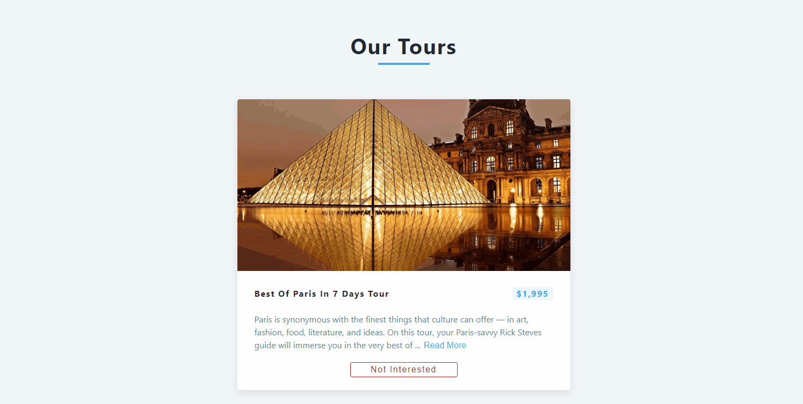

# Tours
This project includes a tour management application created using React. Tour data is fetched from "https://course-api.com/react-tours-project," providing users with various tour options. Users can filter out tours that do not interest them using the "not interested" button.

## Screenshots
 
[Tours Live Page](https://tours-esma.netlify.app/)

## Tech/framework used
<b>Built with</b>  
 

## Description
In the project directory, you can run:
### `npm start`
Runs the app in the development mode.\
Open [http://localhost:3000](http://localhost:3000) to view it in your browser.
## API Reference
https://course-api.com/react-tours-project

 
